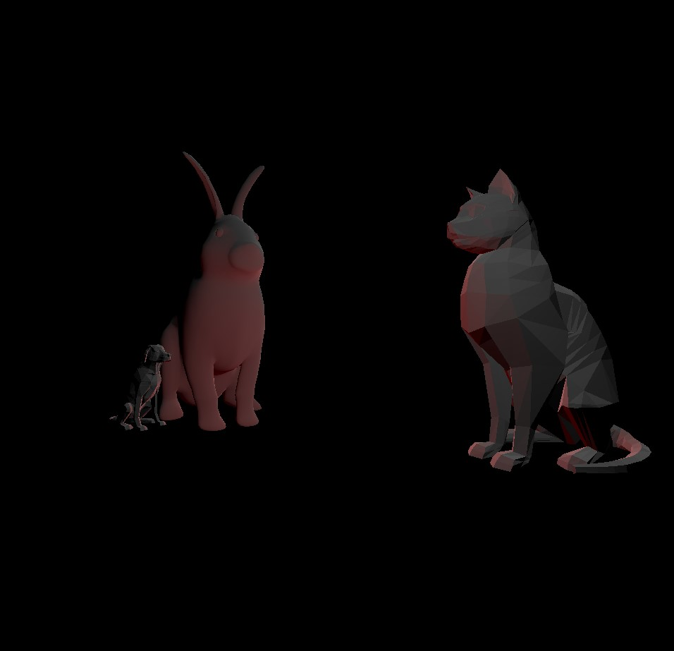

# CMPM163Labs
 
 Lab2 Moving Cubes: https://drive.google.com/file/d/1cFFc1nCYtB62KVvQSR07Y7ArKJZs33ck/view?usp=sharing

 3D model image:

Lab3:
    Video: https://drive.google.com/file/d/1MkO1iNGnAZ8WpRFxMO5qwY2RV9m9s7Yc/view?usp=sharing
    For the first cube on the left, I interpolated between a really bright green and red using my own shaders
    For the second cube on the left, I followed the tutorial to get the green specular highlight
    For the third cube from the left, I use the my own shader to interpolate between lavender and aquamarine
    For the fourth cube from the left, I made its color yellow and its specularity red, but I also made it so shiny that you can't really see the red.