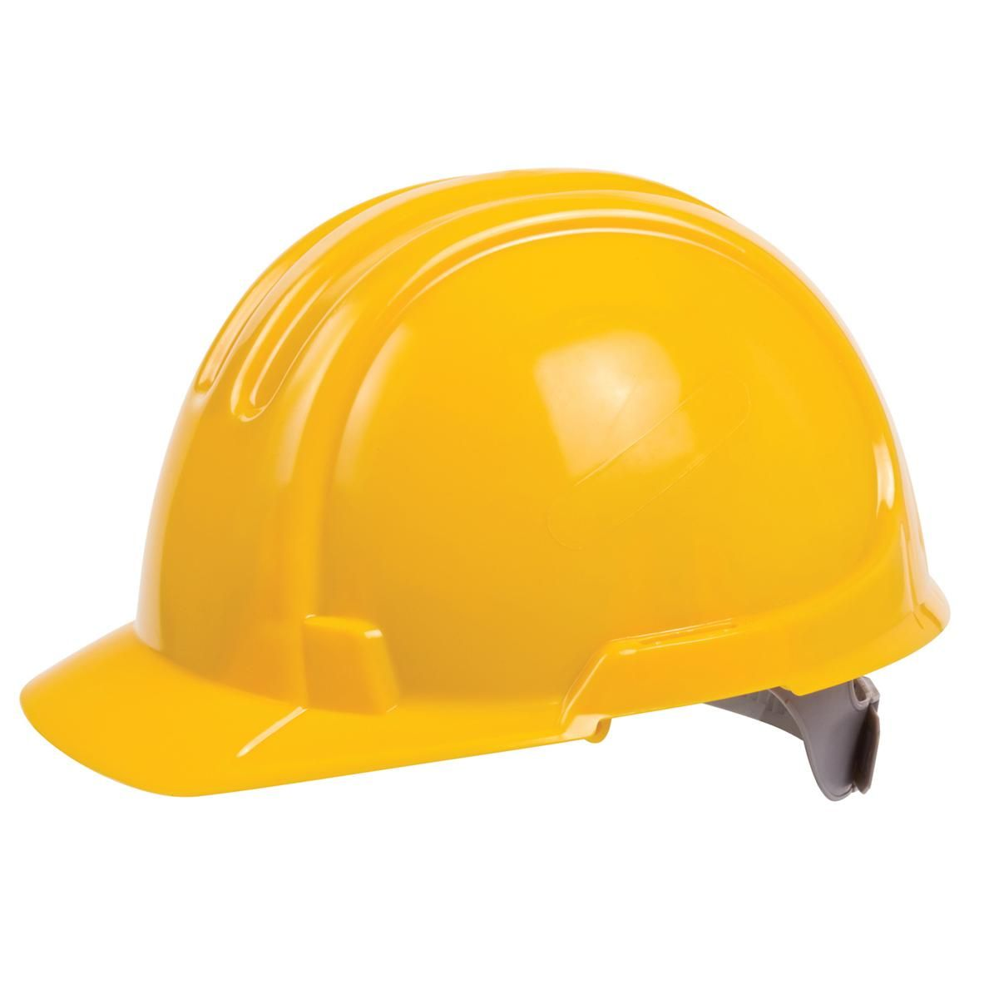
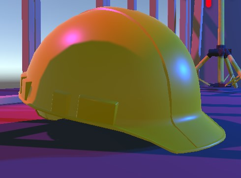

# CMPM163Labs
 
 Lab2 Moving Cubes: https://drive.google.com/file/d/1cFFc1nCYtB62KVvQSR07Y7ArKJZs33ck/view?usp=sharing

 3D model image:

Lab3:
    Video: https://drive.google.com/file/d/1MkO1iNGnAZ8WpRFxMO5qwY2RV9m9s7Yc/view?usp=sharing
    For the first cube on the left, I use my own fragment shader without defining colors to get the rainbow color. 
    For the second cube on the left, I followed the tutorial to get the green specular highlight. 
    For the third cube from the left, I use the my own shader to interpolate between lavender and aquamarine. 
    For the fourth cube from the left, I made its color yellow and its specularity red, but I also made it so shiny that you can't really see the red.

Lab4:
    Questions:
        a. u = x / width + 0.5 / width;
        b. v = y / height + 0.5 / height;
        c. White

    Link:
        https://drive.google.com/file/d/1FnyRm3RNrbjeQ4QgDNhu7lDILrNc0Wfc/view?usp=sharing

    Cubes:
        For the first 4 cubes, I followed the tutorial.
        For the tiled cube, I made another add cube function. Then in the fragment shader I made checks
        to see if the texture is going past 1, and if it is, subtracting the coords by 1 to get the right location to tile from.

Lab 5:
    Video Link: https://drive.google.com/file/d/1Ct0e82iQBbPrSXRVUhZ33kAO0hms6ocj/view?usp=sharing

    Description: I modified the particle system in my own way with the particles going up from the tires. I also tried to give the map a Vaporwave aesthetic by
                changing the colors of most things in the scene as well as the sun's light color.

Lab 6:
    Spotlight: Behaves like a flashlight. It points in a direction based on it's rotation and position. It illuminates in a cone.
    Direcional Light: Behaves like the sun. It affects all objects in the scene, lighting them based on the light's direction.
    Point Light: Behaves like a bare light bulb. It illuminates objects in the scene based on the light's position.
    Area Light: Only work when baking a light map. Shines in all directions to 1 side of the rectangular plane.

    How I made the hard hat material: I made a new material and set the diffuse color to the bright yellow you always see. Then I made it somewhat metallic and smooth, giving it the same reflection look to it.

